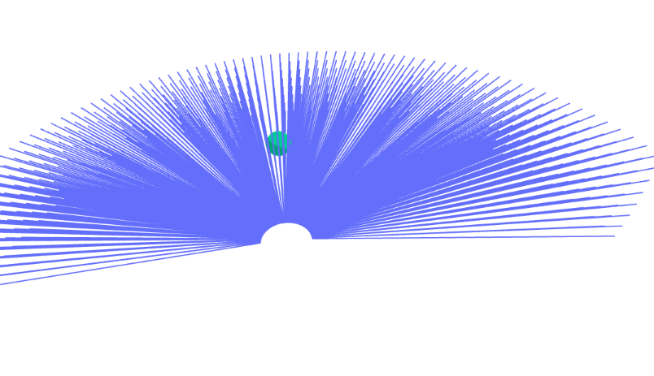
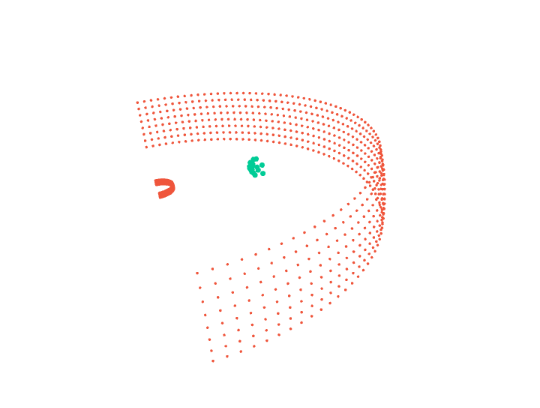

# raytorch

Raytorch : a differentiable ray intersection using Pytorch.





## Usage

Simulating LiDAR sampling on mesh scenes (with possible support for more graphic representative in the future).

Explore `test/LiDAR_test.ipynb` for more details.

```python
obj = ico_sphere(level = 1)
translate = Translate(x=0, y=10, z=0)
new_verts = translate.transform_points(obj.verts_padded())
obj = obj.update_padded(new_verts)
vertices = obj.verts_packed()
faces = obj.faces_packed()
vert_aligned = vertices[faces]

lidar = LiDAR_base(torch.tensor([0.0, 0.0, 0.0]),
                    azi_range = [0, 180],
                    polar_range = [80, 100],
                    res = [2.5, 2.5],
                    min_range = 1.5,
                    max_range = 20)

intersection = lidar.scan_triangles(obj)
plot_scene({
    "test": {"ray": visualize_LiDAR(lidar),
             "points": visualize_point_clouds(intersection)},
},
    raybundle_ray_line_width=2.0,
    pointcloud_marker_size=2.0
)
```

## Installation

a. Install pytorch following the instructions from https://pytorch.org/ or as follows:

```bash
conda install pytorch torchvision torchaudio pytorch-cuda=11.8 -c pytorch -c nvidia
```

b. Install pytorch3d following the instructions from https://github.com/facebookresearch/pytorch3d

c. Install ploty as follows (optional, to visualize)):

```bash
pip install ploty
```

d. Clone this repository and install as follows:

```bash
git clone git@github.com:Uzukidd/raytorch.git
cd raytorch
pip -e install .
```
